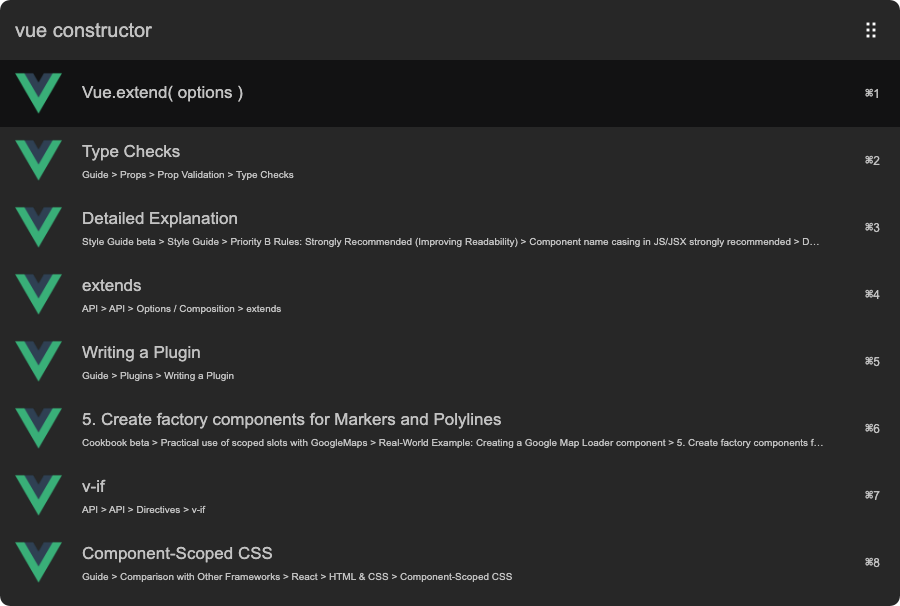

# arvis-vue

> Search for Vue.js API references on vuejs.org



## 🔗 This workflow is converted from [alfred-workflow](https://github.com/radibit/alfred-vue).

* Note that there might be some code change or different actions from the original workflow.

* Marked original workflow's creator to author.

## Install

```
$ npm install -g arvis-vue
```

*Requires [Node.js](https://nodejs.org) 4+*


## Usage

In arvis, type `vue`, <kbd>Enter</kbd>, and your query.


## License

MIT © [radibit](http://radibit.com)
